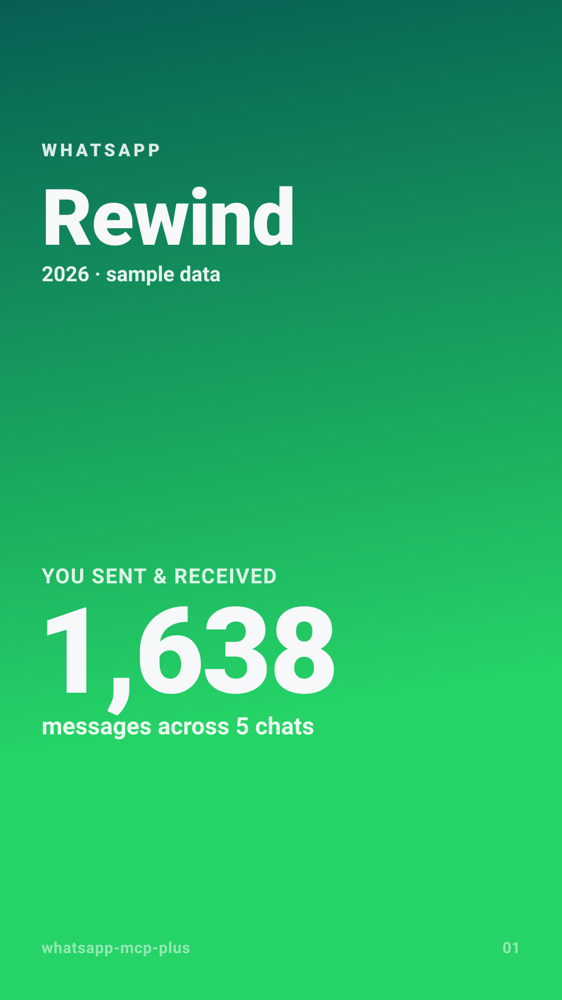
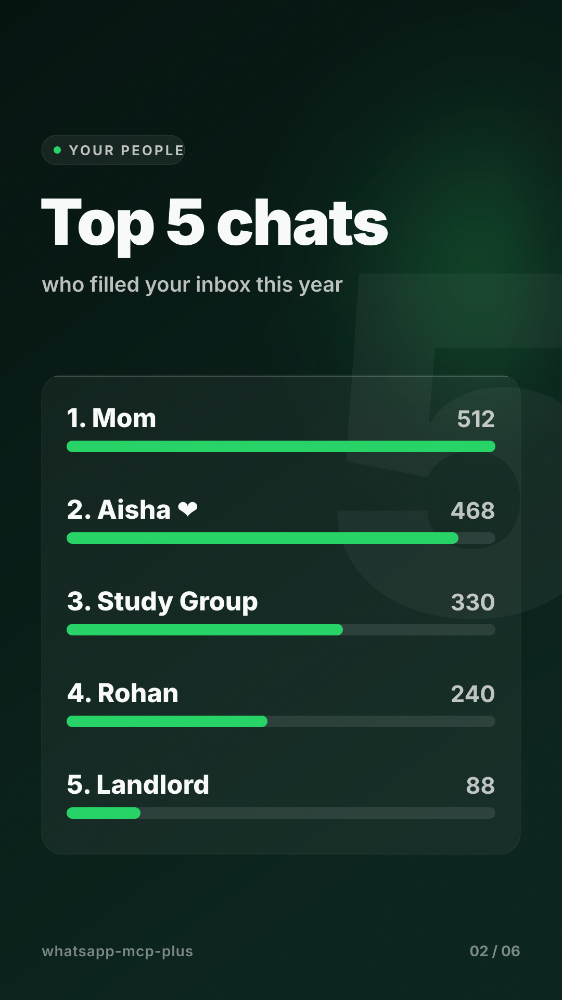
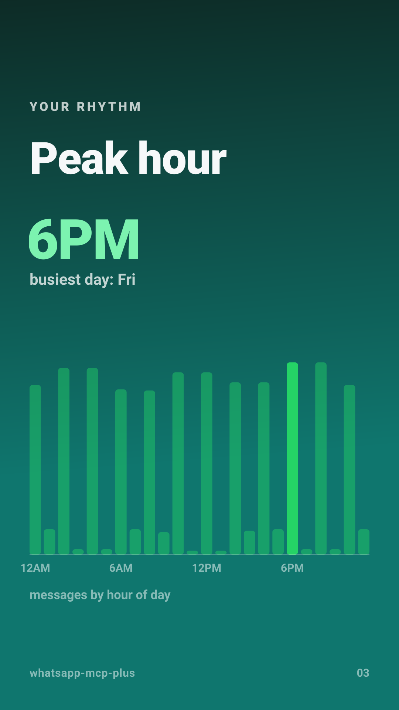
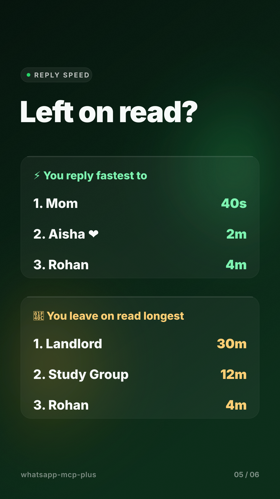

# whatsapp-mcp-plus

A **secure, zero-setup WhatsApp MCP server**. Read-first and safe by default.

It connects your personal WhatsApp to an MCP client (Claude Desktop, Cursor,
Claude Code) so your AI can search, read, summarize, and, when you allow it,
act on your WhatsApp, with guardrails that keep your account safe.

This is a maintained, single-binary successor to the (now abandoned)
[`lharries/whatsapp-mcp`](https://github.com/lharries/whatsapp-mcp), rebuilt in
TypeScript on [Baileys](https://github.com/WhiskeySockets/Baileys) with a safety
layer it never had.

> ⚠️ **Read the [account-safety disclaimer](#account-safety--terms-of-service)
> before using.** This uses an unofficial WhatsApp client. Used carelessly it can
> get your number banned. This tool is designed to minimize that risk, but cannot
> eliminate it.

## WhatsApp Rewind, from your own chats

Ask your AI for `whatsapp_rewind` to generate a **Spotify-Wrapped-style set of
story cards** (1080×1920 SVG) from your history, cover, top people, your daily
rhythm, top emojis, reply-speed leaderboard, and by-the-numbers:

<p>
  
  
  
  
</p>

Prefer a single card? `wrapped_card` writes one shareable SVG; `whatsapp_wrapped`
prints a terminal card. Also: `response_leaderboard` (who you reply to fastest /
leave on read longest), `chat_stats` (per-chat, with reply times), `top_words`,
and `export_chat`.

## Why this instead of the original

| | original (abandoned) | whatsapp-mcp-plus |
| --- | --- | --- |
| Setup | Go bridge **+** Python server, hand-edited config, CGO on Windows | single Node process, one command |
| Safety | none (README even warns about the hole) | read-only default, allowlist, rate limits, confirm-to-send, injection guard |
| Tools | 12 (read + basic send) | 51 (react, reply, edit, delete, groups, presence, polls, transcription, analytics, chat mgmt) |
| Native deps | `go-sqlite3` (needs a C compiler) | none — uses Node's built-in `node:sqlite` |
| Maintained | last commit Jul 2025 | yes |

## Quick start

```bash
npx whatsapp-mcp-plus
```

On first run it prints a QR code in your terminal. Open WhatsApp on your phone →
**Settings → Linked Devices → Link a device** and scan it. Your recent history
syncs into a local SQLite database. Nothing leaves your machine except what the
AI explicitly reads through a tool call.

Or with Docker (both the connection and the server in one container):

```bash
docker build -t whatsapp-mcp-plus .
docker run -it -v wamcp-data:/app/data -v wamcp-auth:/app/auth_info whatsapp-mcp-plus
```

### See the analytics without pairing

Want to see what `whatsapp_wrapped` and `response_leaderboard` produce? Run the
demo, it seeds a sample database and prints the real tool output:

```bash
npm run demo
```

### Wire it into your MCP client

```json
{
  "mcpServers": {
    "whatsapp": {
      "command": "npx",
      "args": ["-y", "whatsapp-mcp-plus"],
      "env": { "WAMCP_MODE": "read-only" }
    }
  }
}
```

- Claude Desktop: `claude_desktop_config.json`
- Cursor: `~/.cursor/mcp.json`

## Safety model (safe by default)

WhatsApp bans are mostly **behavioral**. Reading is low-risk; cold or bulk
sending is high-risk. Defaults are tuned to keep you in the safe zone.

**Modes** (`WAMCP_MODE`):
- `read-only` **(default)** — every write tool is blocked. Search/read/analyze only.
- `assisted` — sending allowed, but gated by allowlist + rate limits + confirm.
- `unrestricted` — rails off (opt-in, not recommended).

**Rails (on by default outside `unrestricted`):**
- **Allowlist** — you can only message existing contacts or people who messaged
  you first (messaging strangers is the #1 ban trigger). Override per-contact
  with the `allowlist_add` tool.
- **Rate limiting** — per-minute + per-day caps and a human-like gap+jitter
  between sends.
- **Confirm-to-send** — a send returns a token and waits; nothing goes out until
  you call `confirm_action`. This stops a prompt-injected message from firing.
- **Injection guard** — incoming messages that look like instructions aimed at an
  AI are flagged so the model treats them as data, not commands.

Every knob is an env var: `WAMCP_ALLOWLIST_ONLY`, `WAMCP_REQUIRE_CONFIRM`,
`WAMCP_RATE_PER_MINUTE`, `WAMCP_RATE_PER_DAY`, `WAMCP_MIN_GAP_MS`, `WAMCP_JITTER_MS`.

## Tools

51 tools (the abandoned original had 12):

**Read:** `search_contacts`, `list_chats`, `list_groups`, `get_chat`,
`list_messages` (with date range), `get_last_interaction`, `contact_info`,
`get_message_context`, `search_messages`
**Send:** `send_message` (with reply), `send_file`, `send_voice_note`,
`send_location`, `send_poll`, `send_contact`
**Message actions:** `react_to_message`, `edit_message`, `delete_message`,
`mark_read`, `forward_message`, `star_message`
**Groups:** `group_info`, `create_group`, `group_update_participants`,
`group_set_subject`, `group_set_description`, `group_invite_link`, `group_leave`
**Chat management:** `pin_chat`, `mute_chat`, `block_contact`,
`check_number_on_whatsapp`, `get_profile_picture`
**Presence / profile:** `send_presence`, `set_profile_status`, `set_profile_name`
**Media / intelligence:** `download_media`, `transcribe_voice_message`
**Analytics:** `whatsapp_rewind` (6-card story set), `wrapped_card` (single
shareable SVG), `whatsapp_wrapped` (terminal card), `response_leaderboard` (who
you reply to fastest / leave on read longest), `top_words`, `chat_stats`
(per-chat, incl. response times), `export_chat` (markdown/text transcript)
**Control:** `get_status`, `get_me`, `set_mode`, `confirm_action`,
`allowlist_add/remove/list`

### Voice transcription

`transcribe_voice_message` downloads a voice note and, if you set
`WAMCP_TRANSCRIPTION_CMD` (a command containing `{input}` that prints a
transcript), runs it through your STT of choice (e.g. whisper). Without it, the
audio is still downloaded and its path returned.

## Configuration reference

| Env var | Default | Meaning |
| --- | --- | --- |
| `WAMCP_MODE` | `read-only` | `read-only` \| `assisted` \| `unrestricted` |
| `WAMCP_DATA_DIR` | `./data` | SQLite DB + logs + downloaded media |
| `WAMCP_AUTH_DIR` | `./auth_info` | WhatsApp pairing credentials |
| `WAMCP_ALLOWLIST_ONLY` | on (safe modes) | restrict sends to known recipients |
| `WAMCP_REQUIRE_CONFIRM` | on (safe modes) | two-step confirm before sending |
| `WAMCP_RATE_PER_MINUTE` | `8` | max sends / minute |
| `WAMCP_RATE_PER_DAY` | `200` | max sends / day |
| `WAMCP_TRANSCRIPTION_CMD` | (none) | STT command template with `{input}` |

## Account safety & Terms of Service

This project uses **Baileys**, an unofficial WhatsApp Web client. Automating a
personal WhatsApp account is against WhatsApp's Terms of Service and **can result
in your number being temporarily or permanently banned.** To reduce that risk:

- Keep the default **read-only** mode unless you truly need to send.
- Never use it for cold outreach, bulk, or identical/spam messages.
- Prefer an established, well-used number over a fresh SIM; avoid VOIP numbers.
- Treat it as a personal assistant, not a marketing tool.

You accept this risk by using the tool. It is provided as-is, for personal and
educational use, with no warranty. Not affiliated with WhatsApp or Meta.

## Credits

Derived from [`whatsapp-mcp-ts`](https://github.com/jlucaso1/whatsapp-mcp-ts)
(ISC) and [`whatsapp-mcp`](https://github.com/lharries/whatsapp-mcp) (MIT). See
[NOTICE](./NOTICE). MIT licensed.
